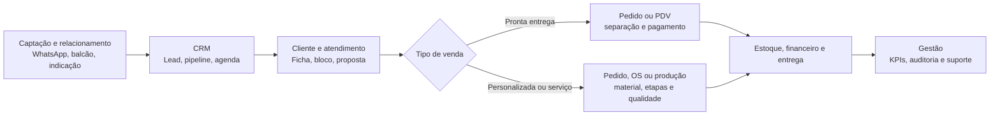

# ORION ERP para Joalherias

O ORION é um **ERP operacional para joalherias**. CRM é um dos seus domínios, não a definição do produto. O sistema reúne captação e relacionamento, atendimento, orçamento, venda, encomenda, produção, estoque, PDV, financeiro, entrega, gestão e suporte em uma única operação.

> `ORION-CRM` é o identificador histórico do repositório e das imagens atuais. Nesta documentação, o produto é chamado de **ORION ERP**. Renomear repositório, imagens, domínios ou infraestrutura é uma decisão futura, não parte desta entrega.

## O que este repositório entrega

O código contém uma aplicação web Next.js, uma API Express, PostgreSQL, Redis, workers BullMQ, NGINX e documentação de operação técnica. O sistema foi concebido para organizar o ciclo completo abaixo.



O diagrama é o **modelo operacional pretendido**. Ele não afirma que todas as setas sejam automáticas ou homologadas. As transições confirmadas, as rotas e as lacunas estão em [Fluxo operacional ponta a ponta](docs/handoff/FLUXO-OPERACIONAL-END-TO-END.md).

## Posicionamento e limites do produto

| É | Não é |
| --- | --- |
| ERP vertical de joalheria, cobrindo da captação à gestão pós-venda | Somente um CRM de leads ou uma agenda de WhatsApp |
| Operação instalada por cliente, com banco, cache e uploads próprios | Multi-tenant lógico comprovado no código |
| Base de código com módulos de operação comercial e administrativa | Prova de que todos os fluxos estão homologados em produção |
| Fundamento para evolução por regras de negócio, specs e tarefas | Autorização para tratar telas ou endpoints como processo de negócio concluído |

## Domínios do ERP

### 1. Relacionamento e vendas

| Domínio | O que resolve | Núcleo técnico observado | Situação de entrega |
| --- | --- | --- | --- |
| Leads e pipeline | Captação, qualificação, dono e evolução comercial | `leads`, `pipelines`, `pipeline_stages`; rotas `leads` e `pipeline(s)` | Implementado em código, validar operação real |
| Clientes | Cadastro 360, preferências, histórico e carteira | `customers`, tags, anexos e timeline | Implementado em código, com fluxos de conversão a homologar |
| Inbox e agenda | Atendimento, atribuição de conversa e compromissos | `conversations`, `messages`, `appointments`, Redis/workers | Parcial, depende de canal e workers externos |
| Atendimento e proposta | Registro técnico/comercial de cada demanda de joalheria | `attendance_blocks`, `proposals`, peças e materiais | Parcial, sem ponte automática comprovada para todos os pedidos |

### 2. Venda, oficina e entrega

| Domínio | O que resolve | Núcleo técnico observado | Situação de entrega |
| --- | --- | --- | --- |
| Pedidos | Venda pronta-entrega e personalizada | `orders`, itens, detalhes customizados | Implementado em código; pagamento e efeitos posteriores exigem prova |
| PDV | Venda de balcão, pagamento e recibo | rotas `pdv`, pedidos, pagamentos, financeiro e estoque | Implementado em código, não homologado com operação real |
| Ordem de serviço e produção | Execução, materiais, etapas e acompanhamento de oficina | `service_orders`, `production_orders`, steps e materiais | Parcial, a fronteira OS versus produção precisa de regra de negócio única |
| Entregas | Retirada, despacho, status e rastreio | `deliveries`, `carriers_config`, adapters | Parcial, transportadoras e tracking são externos |

### 3. Controle e gestão

| Domínio | O que resolve | Núcleo técnico observado | Situação de entrega |
| --- | --- | --- | --- |
| Estoque e catálogo | Produtos, categorias, saldo e movimentação | `products`, `stock_movements`, categorias | Implementado em código; reserva, devolução e baixa de personalizado são lacunas críticas |
| Financeiro e pagamentos | Receitas, despesas, pagamentos, comissões e leitura gerencial | `financial_entries`, `payments`, serviços financeiros | Parcial, conciliação e callbacks externos não homologados |
| Gestão | Dashboard, analytics, usuários, permissões e configurações | rotas de dashboard, analytics, settings e users | Implementado em código, métricas devem ser conciliadas com dados reais |
| Suporte e rastreabilidade | Tickets, erros, roadmap e Base Técnica | tickets, system errors e documentação allowlisted | Parcial; Base Técnica foi testada na API, não no navegador ou produção |

O inventário técnico completo, incluindo telas, persistência, permissão e risco, está em [Dossiês operacionais por módulo](docs/handoff/MODULE-OPERATING-DOSSIERS.md).

## Ciclos que um novo responsável precisa entender antes de alterar código

1. **Captação para cliente.** Um lead pode entrar por canal externo, avançar no pipeline e ser convertido em cliente. A deduplicação, o evento canônico de conversão e a responsabilidade de cadastro devem ser validados com a joalheria antes de mudar regras.
2. **Atendimento para venda.** A Ficha registra blocos de atendimento e pode conter proposta. Não existe evidência de uma conversão automática universal de proposta para pedido. Não criar esse vínculo por inferência.
3. **Pronta entrega.** Pedido e PDV podem tocar pagamento, estoque e financeiro. A transação esperada existe no serviço de PDV, mas o ciclo completo com concorrência, callback de pagamento e operação humana ainda requer homologação.
4. **Personalizado, ajuste e oficina.** Pedido personalizado aprovado pode gerar produção. Ordem de serviço, bloco de atendimento e ordem de produção coexistem, são entidades distintas e não devem ser tratadas como sinônimos.
5. **Estoque e financeiro.** Movimentar peça ou insumo e lançar valor em caixa têm impacto de negócio. Configuração de fluxo, como `stock_action`, não é execução de reserva ou baixa. Qualquer automação nesses domínios exige transação, regra aprovada e teste de rollback.
6. **Entrega e pós-venda.** O registro local de entrega existe, mas emissão, rastreio, transportadora, pagamento e notificação dependem de integrações não exportadas neste pacote.

## Arquitetura que existe hoje

```text
Navegador
  └─ NGINX
      ├─ Next.js (apps/web)
      └─ Express API (apps/api)
          ├─ PostgreSQL 16
          ├─ Redis 7 + BullMQ workers
          ├─ uploads persistentes
          └─ conectores externos: n8n, WhatsApp, Mercado Pago, IA,
             ViaCEP e transportadoras
```

O `docker-compose.yml` atual declara PostgreSQL, Redis, API, Web, NGINX e Adminer. **Não declara n8n**, apesar de a API aceitar URLs e credenciais de n8n. Portanto, automações e canais externos não podem ser considerados prontos só porque há telas, rotas ou variáveis de ambiente.

O PRD histórico menciona Activepieces e componentes Python. O baseline de código e Compose analisado usa TypeScript e integrações n8n. Essa divergência é uma pendência de arquitetura, não uma escolha documentada para o novo responsável. Veja [Automações e IA](docs/handoff/AUTOMACOES-E-IA-TECNICO.md).

## Fonte de verdade e disciplina de mudança

| Pergunta | Fonte que deve ser consultada |
| --- | --- |
| Qual é a regra de negócio pretendida? | `docs/product/` e o PRD do módulo |
| O que está implementado no baseline? | rotas, services, migrations e componentes citados no handoff |
| Qual é a estrutura real do dado? | migrations e [Banco, entidades e relacionamentos](docs/handoff/BANCO-ENTIDADES-E-RELACIONAMENTOS.md) |
| Qual contrato HTTP pode ser alterado? | [Catálogo de rotas](docs/handoff/API-ROUTE-CATALOG.md) e contratos críticos |
| O que foi apenas identificado, não provado? | documentos marcados como **PARCIAL** ou **NÃO HOMOLOGADO** |

Para feature, mudança de regra, API, schema, integração, autorização ou UI, crie primeiro a spec e a task em `docs/specs/` e `docs/tasks/`. O código não é autorização para inventar regra comercial.

## Início seguro para desenvolvimento

1. Copie `.env.example` para `.env` e preencha valores locais. Nunca use os defaults de desenvolvimento do Compose em servidor acessível.
2. Suba o ambiente com `docker compose up -d --build` e acompanhe `docker compose logs -f api web`.
3. As migrations são aplicadas pelo comando do container da API: `node dist/db/migrate.js`. Não aplique SQL manual sem reconciliar a tabela `_migrations` e o dump autorizado do ambiente.
4. Valide rotas e UI com dados sintéticos. Não importe dump de outro cliente, credenciais ou automações de produção neste repositório.
5. Antes de mexer em estoque, financeiro, pedido, produção ou permissões, leia o fluxo ponta a ponta e a migration relacionada. Teste tanto o sucesso quanto falha, concorrência e rollback.

## Deploy atualmente observado, somente referência

O fluxo registrado no repositório é: `push` na `main` → GitHub Actions → build das imagens Docker → push para GHCR → SSH no servidor Hostinger → `docker compose pull` → atualização de API, Web e NGINX. A Action também copia a pasta `docs` da imagem da API para o host antes de recriar os containers.

Isso descreve o estado atual para facilitar a assunção. **Não impõe** GitFlow, branches, CI/CD, GHCR, Hostinger, Docker Compose ou qualquer estratégia futura. O procedimento, suas premissas e os pontos que ainda precisam de prova estão em [Runbook de operações](docs/handoff/OPERATIONS-RUNBOOK.md).

## Estado de validação desta entrega

- **Banco:** baseline exportado até a migration 062; banco de produção, backup, restore e rollback não foram homologados nesta entrega.
- **API/Backend:** build e typecheck foram executados; o teste dedicado da Base Técnica passou isoladamente. Isso não substitui suíte de integração com PostgreSQL/Redis/provedores reais.
- **Frontend/UI:** build realizado; navegador autenticado e fluxos críticos não foram homologados nesta entrega.
- **Integrações:** Meta/WhatsApp, Mercado Pago, n8n, IA e transportadoras dependem de credenciais e recursos externos deliberadamente excluídos.
- **Risco prioritário:** não automatizar reserva/baixa/devolução de estoque ou conciliação financeira até que o evento de negócio, transação e prova end-to-end estejam definidos.

## Leitura por responsabilidade

- **Gestor da joalheria:** ciclos acima e [Fluxo operacional](docs/handoff/FLUXO-OPERACIONAL-END-TO-END.md).
- **Desenvolvedor de ERP:** [Manual operacional do ERP](docs/handoff/ERP-OPERATING-MANUAL.md), banco, contratos e dossiês de módulo.
- **Suporte técnico:** [Portal de handoff](docs/handoff/README.md), runbook, RBAC e Base Técnica `/base-tecnica` para ADMIN.
- **Responsável por infraestrutura:** Compose, Action de deploy e runbook, sempre distinguindo o que está documentado do que foi homologado.

## Licença

Proprietário, todos os direitos reservados. Consulte [LICENSE](LICENSE).

---

**ORION ERP para Joalherias:** relacionamento, venda, oficina, estoque, financeiro e gestão sob uma operação rastreável, sem confundir promessa de produto com evidência de produção.
