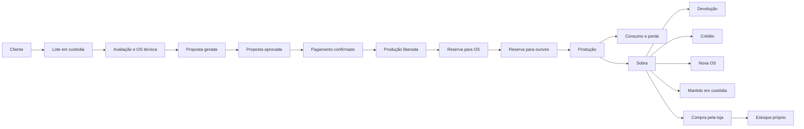

# Visão arquitetural — Estoque, OS, Produção e Custódia

> Data: 2026-06-15  
> Status: proposta para aprovação; sem implementação associada

## Princípio

Estoque próprio e material de cliente são livros operacionais diferentes. O
primeiro representa patrimônio e disponibilidade da loja; o segundo representa
obrigação de guarda, propriedade externa e saldo individualizado por cliente.

## Fronteiras atuais

- `products` e `stock_movements`: estoque próprio.
- `service_orders`: OS criada no atendimento.
- `service_order_materials`: seleção de produtos próprios para a OS.
- `orders`: pedido comercial.
- `production_orders`: execução de produção vinculada a pedido.
- `payments` e `financial_entries`: pagamento e financeiro.

A custódia não deve ser simulada com produto, localização ou status dentro de
`products`, pois isso preservaria quantidade, mas não propriedade, lote,
responsabilidade de guarda ou acordo.

## Integração proposta

O lote de custódia mantém identidade e saldo próprios. A reserva referencia a OS
e a ordem de produção. O evento de conclusão consome a reserva, registra perda e
sobra e atualiza o estado do lote em uma única transação.

A OS criada no Atendimento é um projeto técnico com uma ou mais peças para gerar
a Proposta. Cada peça mantém ficha, materiais, custódia, custos e preço próprios.
A seleção de materiais é planejamento de custo e composição, não uma reserva. A
proposta versionada consolida as peças; depois, `Fazer venda` carrega seu
snapshot no carrinho lateral. A proposta precisa ser aprovada e o pagamento
confirmado antes da criação/liberação da produção e da reserva efetiva.

Somente o destino “compra pela loja” cria movimento de entrada no estoque
próprio. “Crédito” afeta o acerto financeiro, mas não transfere automaticamente
o saldo físico remanescente. “Devolução” exige confirmação de entrega; “nova OS”
gera nova reserva; “manter em custódia” libera o saldo para uso futuro do mesmo
cliente.

## Invariantes

1. Saldo custodiado nunca pode ficar negativo.
2. Um mesmo saldo não pode estar reservado para duas OS simultaneamente.
3. Consumo não pode exceder a reserva sem ajuste autorizado e auditado.
4. Conclusão de produção é idempotente.
5. Estoque próprio só muda após transferência formal de propriedade.
6. Crédito financeiro não apaga obrigação física sem destino registrado.
7. Toda mudança de peso, valor, estado ou proprietário gera evento imutável.
8. Preço de venda manual é independente do custo e do crédito sugerido.
9. Nenhuma produção ou reserva operacional nasce apenas do preenchimento da OS.
10. A versão aprovada da proposta é a referência imutável para liberar produção.
11. Materiais, perda e preço são rastreados por peça, mesmo quando várias peças
    pertencem ao mesmo projeto/proposta.

## Transações críticas

- Liberação para produção: valida proposta aprovada e pagamento confirmado,
  cria a produção uma única vez e referencia a versão comercial aprovada.
- Reserva: após a liberação, faz lock do lote, valida saldo e cria alocação.
- Conclusão: lock da produção, reserva e lote; grava perda, consumo, sobra,
  eventos e status.
- Destinação: lock da sobra; efetiva exatamente um destino.
- Compra pela loja: evento de transferência + entrada no estoque próprio +
  lançamento financeiro conforme política aprovada.

## Decisão arquitetural bloqueadora

O repositório possui duas representações operacionais: `service_orders`, usada
no atendimento, e `production_orders`, vinculada a `orders`. Antes da migration,
é necessário aprovar se a custódia terá vínculo obrigatório com ambas, se uma
passará a originar a outra, ou se haverá uma camada de aplicação que garanta a
ponte e a idempotência.

## Referências

- `../modules/production/research-customer-material-custody.md`
- `../modules/production/spec-customer-material-custody.md`
- `../modules/estoque/prd.md`
