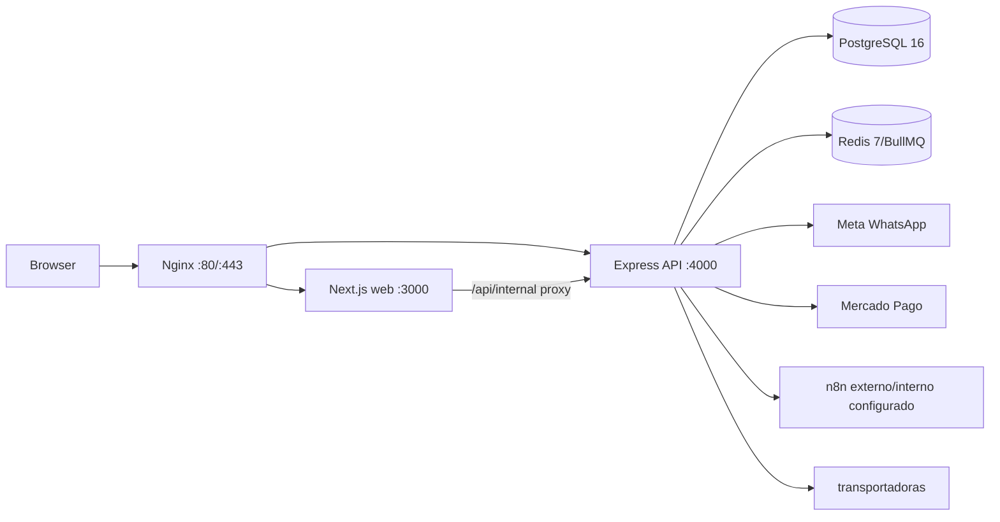
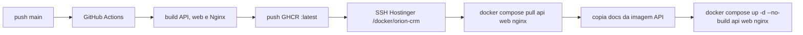

# Arquitetura e operações atuais

**Baseline:** `29c1639`. Este arquivo descreve o deploy encontrado, utilizado
pela Sophxy até o handoff. Não define obrigação futura de GitFlow, CI/CD,
infraestrutura ou fornecedor.

## Containers e comunicação

`docker-compose.yml` declara `postgres`, `redis`, `api`, `web`, `nginx` e
`adminer`. Nginx expõe web/API/health/uploads e devolve 404 para `/n8n/`.
`traefik-proxy` é rede externa obrigatória para Nginx/Adminer, portanto o
Compose não sobe isoladamente se essa rede não existir.

## Deploy observado

Evidência: `.github/workflows/deploy.yml`. Secrets esperados pela Action:
`GITHUB_TOKEN`, `SSH_PRIVATE_KEY` e `GHCR_TOKEN`. Valores não são
documentados nem devem ser copiados para arquivos locais.

## Runbook com comandos evidenciados

| Situação | Comando/evidência | Limite |
| --- | --- | --- |
| Ver configuração | `docker compose config` | exige `.env` e rede externa compatíveis |
| Subir local | `docker compose up -d --build` | documentado em `docs/operations/environment.md`; build local da API pode divergir da Action porque ela copia `docs/` antes |
| Estado | `docker compose ps` | não prova saúde funcional |
| Logs | `docker compose logs <serviço>` | comando Docker padrão; não foi executado nesta passada |
| Migrations | comando do serviço API: `node dist/db/migrate.js` | executa antes da API iniciar; banco real NÃO VALIDADO |
| Atualização usada | Action: pull e `up -d --no-build api web nginx` | não recria PostgreSQL/Redis |

## Migrations, jobs e recuperação

- O runner cria `_migrations`, ordena nomes `.sql`, usa transação por arquivo e
  interrompe em falha. Também pode criar ROOT somente se variáveis de seed forem
  fornecidas e não houver usuários.
- Worker WhatsApp usa BullMQ/Redis, até 3 tentativas com backoff exponencial,
  concorrência 5 e retenção limitada de jobs concluídos/falhos.
- Worker de lembretes de agenda usa BullMQ, até 3 tentativas e envia via
  webhook n8n; só marca `reminder_sent_at` depois da tentativa de envio.
- Backup, restore e rollback estão descritos apenas genericamente no
  `README-DEPLOY.md`; não há script versionado nem evidência de restauração
  testada. Classificação: **NÃO VALIDADO**.

## Divergências e riscos operacionais

1. O Compose contém valores fallback previsíveis para senha de banco e segredos
   de JWT/webhook. Isso é risco de configuração, não um secret a replicar.
2. `README-DEPLOY.md` afirma container e workflows n8n no Compose, mas o Compose
   atual não declara serviço n8n nem diretório de workflows como fonte ativa.
3. A Action copia `docs/.` para `apps/api/docs/` antes do build; o procedimento
   local não faz isso. O Dockerfile API espera esses docs no estágio final.
4. `ensureSettingsSingleton` e seed de workflows n8n aparecem desativados no
   bootstrap da API. Isso reduz crash loop, mas pode esconder banco sem
   settings ou ausência de workflows.
5. `adminer` está roteado pelo Traefik para host de banco. Controle de acesso
   e exposição pública exigem validação de infraestrutura, não comprovada aqui.

## Observabilidade

API registra método, caminho, status, duração, request ID e user ID pelo logger;
workers registram falhas e IDs correlacionáveis. Não foi encontrada evidência de
tracing distribuído, monitoramento externo, backup automatizado ou teste de
rollback nesta passada.
