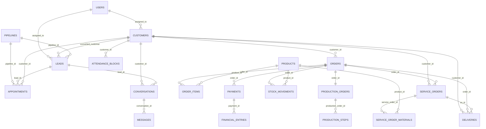

# Banco, entidades e relacionamentos

**Baseline:** migrations `001`–`062`. Este diagrama cobre o núcleo de negócio,
não todas as tabelas auxiliares/configurações.

## Entidades, integridade e leitores/escritores

| Entidade | Chaves/constraints relevantes | Quem escreve/lê | Estado crítico |
| --- | --- | --- | --- |
| `users` | PK UUID, role/status, permissões customizadas posteriores | auth, users, settings | ativo/inativo e role |
| `customers` | contato, responsável, conversão, tags e perfil | clientes, PDV, Ficha, entrega | ownership é regra de aplicação |
| `leads` | `converted_customer_id`, pipeline e stage | leads/pipeline/Ficha | ganho/perda/conversão |
| `appointments` | FK opcional lead/cliente/pipeline; `ON DELETE SET NULL` | agenda/worker | status e reminder_sent_at |
| `conversations/messages` | Meta id único parcial e FK de thread | Inbox/worker WhatsApp | status da conversa/direção/status da mensagem |
| `orders/order_items` | item em cascade; valores em centavos; cliente/responsável obrigatórios | pedidos/PDV/produção | pedido e aprovação/produção/cancelamento |
| `payments` | FK pedido e chave de idempotência | PDV/Mercado Pago | PENDING/APPROVED/CANCELLED |
| `stock_movements` | produto, saldo anterior/novo, autor, pedido opcional | estoque/PDV | ENTRADA/SAIDA/AJUSTE |
| `financial_entries` | valor não zero; pedido/pagamento/comissão opcionais | financeiro/PDV | ENTRADA/SAIDA |
| `production_orders/steps` | um production order por pedido; passos com autor | produção/pedidos | PENDENTE a CONCLUIDA/REPROVADA |
| `service_orders/materials` | cliente obrigatório; material com snapshot | OS/atendimento | prioridade, etapa e custo calculado |
| `deliveries` | cliente obrigatório, pedido/OS opcionais | entrega/transportadora | pending/posted/cancelamento conforme rota |

## Regras de manutenção

- Valores monetários são inteiros em centavos. Não introduzir `FLOAT`.
- O estado de negócio é espalhado entre enums, colunas e regras de rota; não
  alterar enum/estado sem rastrear consumidores frontend/backend.
- FKs não substituem autorização: escopo de cliente e produção é validado na
  aplicação e tem achados de auditoria pendentes.
- Migrations são aplicadas por ordem lexical e registradas em `_migrations`.
  Uma migration nova não deve reescrever a semântica de uma já aplicada.

## Catálogo técnico das entidades centrais

As colunas abaixo foram verificadas nas migrations `001`–`062`. “Escritor e
leitor” aponta a superfície principal no código, não uma lista exaustiva de
cada `SELECT`.

| Tabela e migrations | PK/FKs e campos críticos | Constraints/índices relevantes | Escritor, leitor e regra |
| --- | --- | --- | --- |
| `users` (002, 013, 030, 038) | UUID; role, status, `commission_rate`, `custom_permissions` | comissão entre 0–100; índices email, role e status | auth/users/settings escrevem; todo RBAC lê role no JWT. |
| `refresh_tokens` (002) | UUID; `user_id → users`; hash e expiração | índices por usuário e hash | auth login/refresh escreve e consome; revogação deve manter hash, não token bruto. |
| `customers` (003, 030, 056, 059) | UUID; `assigned_to → users`; contato, CPF, LTV, conversão, perfil e tags | LTV não negativo; índices WhatsApp, CPF parcial, assigned e GIN de nome | customers, PDV, entrega e Ficha escrevem/leem; ownership é regra de aplicação. |
| `leads` (003, 016, 017, 039, 049) | UUID; `assigned_to → users`, `converted_customer_id → customers`, `pipeline_id/stage_id` | valor estimado e tarefas abertas não negativos; índices WhatsApp, stage, pipeline e última interação; unicidade por pipeline posterior | leads, pipeline e n8n escrevem; conversão não é garantida apenas por FK. |
| `pipeline_stages` e `pipelines` (016, 017) | UUID; stage aponta pipeline; pipeline aponta creator | posição > 0, cor hex, não pode `is_won` e `is_lost`; índices posição/pipeline/default | pipeline/pipelines routes escrevem; lead, agenda e Inbox podem ler referências. |
| `lead_tasks`, `lead_attachments`, `lead_timeline` (016) | task/anexo/timeline apontam lead; usuários em assigned/created/uploaded | cascata na exclusão de lead; file size >= 0; índices lead, due/open e timeline | leads routes escrevem/leem; anexos são dado sensível e exigem storage válido. |
| `conversations` e `messages` (004, 018, 024) | conversa aponta lead/cliente/assigned/pipeline/stage; mensagem aponta conversa/sent_by | índices WhatsApp, status, assigned, canal, external ID, unread; Meta id parcial | inbox, worker Meta e n8n escrevem; direção/status não substituem entrega física ao provedor. |
| `quick_replies` e `channel_integrations` (018) | UUID; quick reply aponta creator | índices categoria/título; configurações de canal próprias | inbox/integrations administram; credenciais não devem entrar em documentação/export. |
| `appointments` (042, 053–055) | UUID; FKs opcionais lead/cliente/assigned/pipeline | `ON DELETE SET NULL`; índices starts_at, lead, cliente, responsável e status | appointments/n8n escrevem; worker de reminder lê/marca; agenda local não é Calendar externo. |
| `attendance_blocks` e `ai_renders` (030, 031) | bloco aponta customer obrigatório, lead e creator; render aponta bloco/customer/approver | índice por cliente/status; `so_number` único parcial; campos técnicos e valores em centavos | attendance/renders escrevem; status `OS` não cria automaticamente `service_orders`. |
| `proposals`, `proposal_pieces`, `proposal_piece_materials` (061) | proposta aponta cliente, bloco e responsável; peças/material em cascata | status restrito draft/registered e draft/ready; material exige origem compatível; índices por proposta/piece | proposals routes escrevem/leem; não existe ponte automática comprovada para pedido/estoque. |
| `products` (005, 029, 050, 052) | UUID; código, preço, estoque, mínimo, peso, categoria | preço > 0, estoque/mínimo >= 0, peso > 0; índices código, GIN nome, categoria e alerta parcial | products/PDV/ordens/OS escrevem ou leem; não usar `FLOAT` para preço. |
| `orders`, `order_items`, `custom_order_details` (006, 020, 027, 057–058) | pedido aponta cliente e responsável; item aponta pedido e produto; custom detail é 1:1 | valores >= 0, item quantity > 0 e preço > 0; cascade de itens; índices número, cliente, status e criação | orders/PDV/loja escrevem; aprovação de personalizado pode criar produção em transação. |
| `production_orders` e `production_steps` (007, 060) | production é 1:1 com pedido; step aponta production e usuário | `order_id` único; índices pedido, responsável e status | orders cria em caso específico; production avança/atribui/pausa; OS é entidade distinta. |
| `payments` (008, 058) | UUID; `order_id → orders`; amount, provider IDs, idempotency | amount > 0; índices Mercado Pago parcial, idempotência e pedido | PDV/payments/webhook podem escrever; confirmação externa precisa ser idempotente. |
| `stock_movements` (009, 029) | UUID; produto obrigatório, pedido opcional, creator obrigatório; antes/depois | índices produto e criação | products/PDV escrevem; disponibilidade e concorrência exigem transação/lock no serviço. |
| `financial_entries` (009, 045–046) | UUID; pedido/pagamento/comissão opcionais; creator obrigatório | amount diferente de zero; comissão >= 0; índices type, competence date, pedido e criação | financeiro/PDV escrevem; tipo ENTRADA/SAÍDA nasce no fluxo da rota, não na FK. |
| `service_orders` e `service_order_materials` (030, 051) | OS aponta cliente obrigatório, pedido/bloco/render opcionais; material aponta OS/produto | material em cascata; quantity > 0; índices cliente, status/due date e material | service-orders escreve; material guarda snapshot, mas não prova baixa de estoque. |
| `deliveries` e `carriers_config` (030, 032) | entrega aponta cliente obrigatório e pedido/OS opcionais | índices e status definidos na migration/rota | deliveries/carreiras escrevem; tracking depende de adapter externo. |
| `automation_flows` e `automation_executions` (011, 014, 048) | execução aponta flow; flow aponta creator | contadores >= 0; índices status, trigger e execução | flows/automations/n8n usam; nome legado `activepieces_flow_id` não prova Activepieces ativo. |
| `store_config`, `store_categories`, `store_products`, `store_orders` (019, 020) | produto loja pode apontar produto estoque/categoria; pedido loja aponta produto | preço > 0; FKs `SET NULL` para catálogo; índices publicação, ordem e pagamentos | store/store-settings escrevem; sincronização com CRM/pagamento ainda é parcial. |
| `audit_logs`, `system_tickets`, `system_errors` (010, 044, 047) | audit e ticket apontam usuário; erro pode ter dados de cliente | índices user/entity/created e status | middleware/ações explícitas escrevem audit; suporte e reporter escrevem tickets/erros; cobertura de audit não é uniforme. |

## Limites de integridade que exigem atenção

1. Várias FKs são opcionais de propósito, por exemplo `lead_id`/`customer_id`
   em agenda e pedido/OS em entrega. A ausência de FK não autoriza inferir um
   fluxo automático.
2. `CHECK`, índice e `ON DELETE` protegem formato ou referência, mas não
   resolvem autorização, tenancy, concorrência de estoque ou transição de
   status. Essas regras vivem em middleware, rotas e serviços.
3. A migração local `063_flow_stage_stock_action.sql` está fora deste catálogo
   e do baseline. Sua presença no diretório não prova execução de reserva ou
   baixa.

## Auditoria de comentários críticos

Comentários úteis já existem em `order-financial.service.ts` (baixa e
idempotência), `service-orders.routes.ts` (material sem baixa) e workers
(retries/efeitos). Não foi adicionado comentário de baixo valor nesta passada.
Os pontos pendentes de correção são contratos/riscos, não falta de explicação
local; comentário não deve substituir spec, teste ou controle de autorização.

## Limites

ER não prova schema aplicado em PostgreSQL real. Há migration `063` no WIP
local, excluída deste baseline. PostgreSQL real: **NÃO VALIDADO**.
