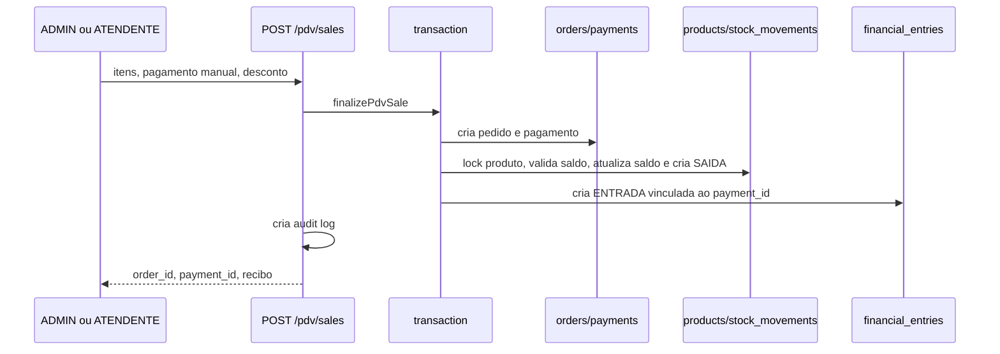

# Estoque, Financeiro e PDV, contratos transversais

**Baseline:** `29c1639`. Estados e integrações abaixo vêm das rotas, serviços e
migrations citados; não são homologação de operação real.

## Modelo persistente

| Tabela | Origem | Escritores principais | Papel |
| --- | --- | --- | --- |
| `products` | migrations `005`, `029`, `050` | `products.routes.ts` | catálogo, preço, custo e saldo atual |
| `stock_movements` | `009` | `order-financial.service.ts`, rotas de estoque | histórico de ENTRADA, SAIDA ou AJUSTE com saldo anterior/posterior |
| `orders` / `order_items` | `006` | pedidos e PDV | venda, tipo, estado, itens e valores em centavos |
| `payments` | `008` | PDV, pedidos, Mercado Pago | intenção/registro de pagamento e idempotência |
| `financial_entries` | `009` | `order-financial.service.ts`, `financial.routes.ts` | entrada, saída, comissão, vínculo com pedido/pagamento |
| `service_order_materials` | `051` | `service-orders.routes.ts` | materiais de OS e snapshots de preço/custo; não é baixa de estoque |

## Fluxo de PDV de pronta-entrega

`POST /api/v1/pdv/sales` requer `ADMIN` ou `ATENDENTE`, valida ao menos um
item e usa `transaction(...)`. Em `applyProntaEntregaStockDecrease`, o serviço
faz `SELECT ... FOR UPDATE`, recusa estoque insuficiente e evita duplicar baixa
quando já há `stock_movements` de saída para o pedido. A entrada financeira é
deduplicada por `payment_id`.

## Operações de estoque identificadas

| Operação | Evidência | Estado anterior → posterior | Impacto |
| --- | --- | --- | --- |
| Entrada, saída e ajuste | `products.routes.ts`; `stock_movements` em `009` | produto e movimento preservam `previous_stock`/`new_stock` | altera saldo do catálogo |
| Venda PDV pronta-entrega | `finalizePdvSale` → `applyProntaEntregaStockDecrease` | saldo suficiente → saldo reduzido; movimento `SAIDA` | pedido, pagamento, financeiro e auditoria |
| Material de OS | `service-orders.routes.ts` | catálogo de material e recálculo de custo/total | **sem baixa real**, segundo comentário de implementação |
| Cancelamento/devolução/reserva | rotas e documentação requerem revisão específica | NÃO confirmado nesta passada | não declarar automático sem evidência |

## Financeiro

- `financial_entries` guarda valores inteiros em centavos e não aceita valor
  zero (`CHECK amount_cents != 0`).
- Pagamento aprovado cria `ENTRADA`, categoria `VENDAS_BALCAO` ou
  `VENDAS_ONLINE`, com pedido, pagamento e comissão quando existe responsável.
- `financial.routes.ts` restringe listagem financeira a `ROOT`, `ADMIN` e
  `FINANCEIRO`; também contém criação/edição de lançamentos e upload de
  comprovante, com magic bytes para PNG/JPG/PDF.
- Dashboard e lançamentos canônicos são calculados em `financeiro.service.ts`.
  Conciliação bancária não foi encontrada como fluxo confirmado.

## Pagamento e Mercado Pago

`POST /api/v1/pdv/mp-link` fecha a venda com método `LINK_PAGAMENTO`, cria uma
preferência Mercado Pago fora da transação de venda e devolve URL/preference ID.
Se a criação externa falhar depois de a venda ser fechada, há risco operacional
de pedido/pagamento local sem link válido; tratar como **PARCIAL** até teste de
compensação/retry.

## Permissões e riscos

| Superfície | Regra observada | Risco/lacuna |
| --- | --- | --- |
| PDV | ADMIN, ATENDENTE | RBAC de detalhe/cancelamento precisa ser documentado por endpoint de pedidos |
| Financeiro | ROOT, ADMIN, FINANCEIRO | acesso à UI não é prova de proteção de todas as rotas |
| OS/material | ADMIN/ATENDENTE/GERENTE na criação de OS; PRODUCAO na etapa | custo e material não significam baixa de estoque |
| Pagamento externo | integração Mercado Pago | callback, idempotência e compensação exigem mapa específico |

## Estado de validação

- Build estático anterior: válido para API/web/Docker, conforme evidência de
  handoff anterior.
- PostgreSQL real, movimentos reais, webhook Mercado Pago, cancelamento,
  devolução, reserva e conciliação: **NÃO VALIDADOS** nesta segunda passada.
