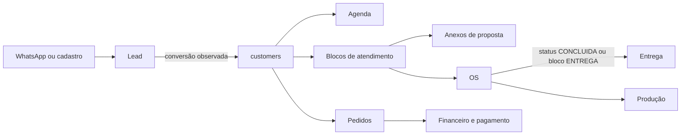

# Ficha do Cliente, mapa técnico verificável

**Baseline:** `29c1639`. Este documento descreve código, não promessa de PRD.

## Entrada e proteção

| Camada | Evidência | Responsabilidade |
| --- | --- | --- |
| Página | `apps/web/app/(crm)/clientes/[id]/page.tsx` | exige sessão, busca `/customers/:id/full`, tenta fallback `/customers/:id` e redireciona para `/clientes` em falha |
| Shell | `components/ClientPanelShell.tsx` | carrega cliente, permissões customizadas, abas, lead/pipeline associado e elegibilidade de entrega |
| Backend | `apps/api/src/routes/customers.routes.ts` | lista, detalhe, edição, histórico, feedback e relações de cliente |
| Autorização | `authenticate` + `requireRole`/helpers por rota | a UI filtra abas por `ficha.*.view`; essa filtragem não substitui autorização de endpoint |

`ClientPanelShell` recebe `custom_permissions` via `/users/me` e filtra as abas
por `usePermissions`. Falha nesta consulta retorna `{}`, aplicando o default de
role. É uma decisão de **visibilidade**, não prova de autorização backend.

## Abas e chamadas reais

| Aba | Componentes | Chamadas observadas | Estado / limite |
| --- | --- | --- | --- |
| Ficha | `ClientFichaTab` | `PATCH /api/internal/customers/:id`; ViaCEP externo; `POST /api/internal/leads/:id/convert` | edita dados; a conversão só existe quando o `id` é lead |
| Agenda | `LeadAppointmentsTab` | depende de `leadId` encontrado por busca do WhatsApp | sem lead associado, o componente recebe `null` |
| Atendimento | `ClientAtendimentoTab` | `GET /customers/:id/blocks?pipeline_status=ATENDIMENTO,PROPOSTA` | usa blocos de atendimento e pode criar OS via fluxo interno |
| Proposta | `ClientPropostaTab` | `GET/POST/DELETE /customers/:id/proposals/attachments` | trata anexos de proposta; proposta comercial completa requer rastreio separado |
| Pedidos | `ClientPedidosTab` | `GET /orders/:id` e `GET /orders?...` | leitura de pedidos filtrados pelo cliente |
| OS | `ClientOSTab` | `GET /customers/:id/blocks?pipeline_status=OS,ENTREGA`; rota de OS é montada em `service-orders.routes.ts` | materiais de OS não fazem baixa real de estoque nessa rota |
| Entrega | `ClientEntregaTab` | `GET /customers/:id/deliveries`; `PATCH /deliveries/:id/status`; tracking | criação exige elegibilidade calculada no shell |
| Histórico | `ClientHistoricoTab` | `GET /customers/:id/{feedback,history}` | histórico WhatsApp e feedback têm achados de auditoria pendentes |

## Fluxo que o código permite

O diagrama é de relacionamento técnico. Ele **não** comprova que cada transição
seja automática, atômica ou homologada. `ClientPanelShell` procura lead por
WhatsApp, move etapa por `PATCH /api/internal/leads/:id/stage` e mantém a etapa
localmente após resposta 2xx.

## Persistência e relações

| Entidade | Migrations | Relação observada |
| --- | --- | --- |
| `customers` | `003`, `030`, `056`, `059` | identidade, contato, endereço, preferências, tags, conversão e LTV |
| `leads` | `003`, `016`, `017`, `049` | pode apontar para `converted_customer_id`; pipeline/etapa alimentam a stagebar |
| `attendance_blocks` | `030`, `031` | associado ao cliente e contém `pipeline_status`; usado em atendimento, OS e elegibilidade de entrega |
| `service_orders` | `030`, `051` | liga cliente, pedido, bloco e materiais; `service_order_materials` mantém snapshots de preço/custo |
| `orders` | `006`, `027`, `057`, `058` | pedido associado a cliente e fontes financeiras/PDV conforme rotas próprias |
| `deliveries` | `030`, `032` | liga cliente, pedido ou OS e opcionalmente transportadora |

## Regras e efeitos relevantes

- Edição de cliente usa a política documentada em `assertCanEditCustomer`: ROOT,
  ADMIN, dono `assigned_to` ou `custom_permissions.clientes_outros`.
- A criação de entrega fica habilitada se existir OS `CONCLUIDA` ou bloco com
  `pipeline_status === ENTREGA`; erro de consulta é engolido e o botão permanece
  desabilitado.
- Criação de OS usa `POST /service-orders` para ADMIN/ATENDENTE/GERENTE; edição
  geral é ADMIN/GERENTE e avanço de etapa aceita PRODUCAO.
- Inclusão de material em OS recalcula valores, mas o comentário da rota afirma
  que a baixa real de estoque ocorre apenas no faturamento do PDV, não nessa
  operação.

## Lacunas e não homologações

- A busca de elegibilidade e a busca de lead usam `fetch` direto e fazem fallback
  silencioso. Um erro de contrato pode parecer ausência de dado.
- O histórico WhatsApp/feedback, RBAC de clientes e XSS em atendimento têm riscos
  já identificados em `docs/qa/reports/architecture/backend-database-audit.md`.
- Não há evidência nesta passada de teste ponta a ponta para WhatsApp → agenda →
  lead → cliente → OS → entrega.
- PostgreSQL real: **NÃO VALIDADO**.
