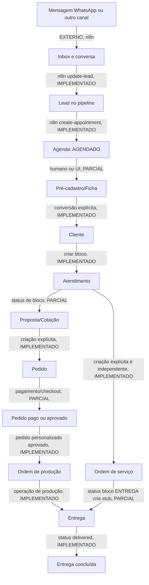

# Fluxo operacional ponta a ponta

## Leitura correta

O fluxo abaixo combina contratos de código no commit `29c1639`. Uma seta só é
automática quando o código efetivamente escreve o próximo registro. Fluxos
externos, transições humanas e runtime não verificado estão marcados para que a
equipe não trate um desenho de tela como automação entregue.

## Tabela de transições verificadas

| Origem → destino | Como ocorre no código | Status | Limite/risco |
| --- | --- | --- | --- |
| Canal → Inbox | `POST /api/v1/n8n/webhook/new-message` cria/upserta conversa e registra inbound | PARCIAL | entrada no canal e n8n são externos, NÃO VALIDADOS |
| Inbox → Lead | `update-lead` faz upsert por telefone e pipeline `leads` | IMPLEMENTADO | depende de pipeline/stage existir; dados coletados viram texto em `notes` |
| Lead → Agenda | `create-appointment` cria/upserta lead, cria appointment e muda stage para `QUALIFICADO` | IMPLEMENTADO | disponibilidade usa somente agenda local; job requer Redis |
| Agenda → pré-cadastro | UI e relações Lead/Cliente estão presentes | PARCIAL | não há conversão automática deduzida desse endpoint |
| Lead → Cliente | atendimento recusa criar bloco quando o ID ainda é lead e orienta conversão pela Ficha | IMPLEMENTADO como guard | endpoint exato de conversão deve ser mantido conforme `customers.routes.ts`; não homologado em browser |
| Cliente → Atendimento | `POST /api/v1/customers/:customerId/blocks` grava `attendance_blocks` | IMPLEMENTADO | exige cliente existente e RBAC |
| Atendimento → Proposta/Cotação | dados de produto, preço e status são mantidos no bloco | PARCIAL | não foi comprovada criação automática de proposta comercial por bloco |
| Cliente → Pedido | `POST /api/v1/orders` cria pedido, itens e detalhes personalizados | IMPLEMENTADO | criação é explícita; não foi achado vínculo automático com proposta/bloco |
| Pedido personalizada aprovado → Produção | PATCH status `APROVADO` cria `production_orders` uma vez, dentro de transação | IMPLEMENTADO | exige detalhe personalizado e permissão `order.approve` |
| Pedido pronta-entrega → estoque/financeiro | serviço de PDV tem transação de venda, baixa e financeiro | PARCIAL | não equivale a todo pedido criado pela tela Pedidos; validar fluxo comercial separado |
| Atendimento → OS | status `OS` apenas gera `so_number` no bloco e exige produto | PARCIAL | não cria `service_orders`; OS tem rota própria e o vínculo precisa ser confirmado operacionalmente |
| OS/Atendimento → Entrega | ao mudar bloco para `ENTREGA`, tenta criar delivery stub não fatal | PARCIAL | no create busca OS ligada ao bloco; no patch cria stub sem `so_id`; `ON CONFLICT` sem alvo é comportamento a validar |
| Pedido → Checkout MP | loja e PDV podem criar preferência Mercado Pago | PARCIAL | confirmação/webhook do pagamento não foi homologado nesta passada |
| Entrega → concluída | rota de status aceita `delivered`, registra data; tracking pode consultar transportadora | IMPLEMENTADO | transportadora e tracking são externos, NÃO VALIDADOS |

## Estados e responsabilidades

| Domínio | Estados/código observado | Responsável que muda | Não assumir |
| --- | --- | --- | --- |
| Lead | `NOVO`, `QUALIFICADO`, `PROPOSTA_ENVIADA`, `NEGOCIACAO`, `CONVERTIDO`, `PERDIDO` | bot n8n ou operador/pipeline | que todo stage possui regra de automação |
| Appointment | criação n8n com `AGENDADO`; cancelado/concluído são lidos no cálculo de slots | n8n ou operador | sincronização Google Calendar |
| Bloco de atendimento | pipeline inclui `OS` e `ENTREGA`; campos técnicos, sinal e total | atendente, gerente, produção conforme rota | que `OS` materializa uma `service_order` |
| Pedido | pronta entrega começa `AGUARDANDO_PAGAMENTO`; personalizado começa `AGUARDANDO_APROVACAO_DESIGN` | atendente, financeiro; aprovação com permissão | que todo pagamento baixa estoque automaticamente |
| Produção | pedido personalizado aprovado cria ordem `PENDENTE` em `SOLDA` | produção e aprovador | que uma OS e uma production order sejam a mesma entidade |
| Entrega | `pending`, `posted`, `in_transit`, `out_for_delivery`, `delivered`, `failed`; cancelamento separado | operador ou adaptador de transportadora | emissão de etiqueta e tracking reais sem credenciais |

## Pontos que exigem decisão do negócio

1. Definir a fonte canônica da encomenda personalizada: `attendance_blocks` +
   `service_orders`, ou `orders` + `production_orders`. Hoje coexistem e não há
   ponte automática provada.
2. Definir o evento que converte lead em cliente, inclusive deduplicação por
   telefone/CPF e dono do cadastro. O guard evita atendimento em lead, mas não
   substitui regra de conversão.
3. Definir se `ENTREGA` no bloco deve criar delivery somente quando houver OS,
   pedido, ambos, ou nenhum. O comportamento atual é inconsistente entre create
   e patch.
4. Definir regra única para reserva/baixa de estoque de personalização. A
   configuração de `stock_action` local não é execução de estoque e não entra
   no baseline.

## Evidências de implementação

- `apps/api/src/routes/n8n.routes.ts`, `appointments.routes.ts` e `inbox.service.ts`
- `apps/api/src/routes/attendance.routes.ts`
- `apps/api/src/routes/orders.routes.ts` e `services/order-financial.service.ts`
- `apps/api/src/routes/service-orders.routes.ts`, `production.routes.ts` e
  `deliveries.routes.ts`
- `apps/web/app/(crm)/clientes/[id]/` e `apps/web/app/(crm)/pedidos/`

Banco, API/Backend, Frontend/UI e integrações externas desta cadeia permanecem
**NÃO HOMOLOGADOS em runtime**. Este documento é mapa para validação, não
autorização de operação ou deploy.
