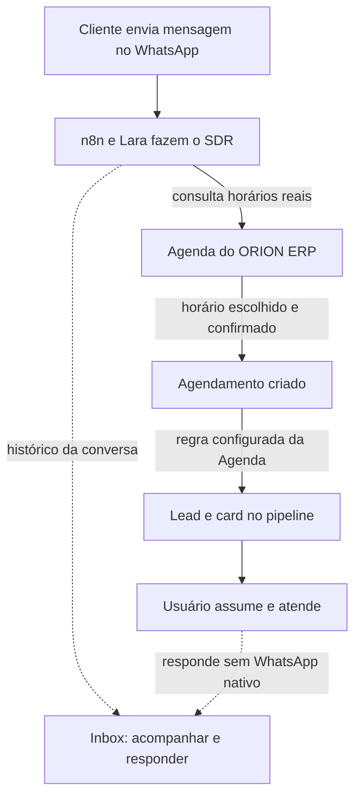
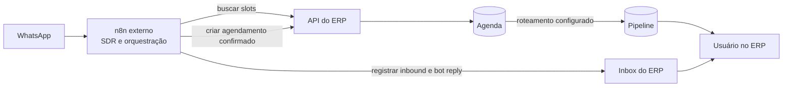
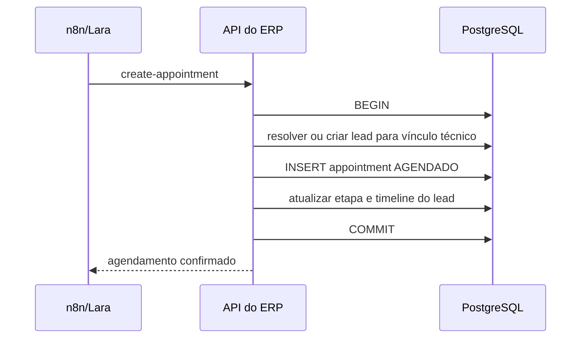
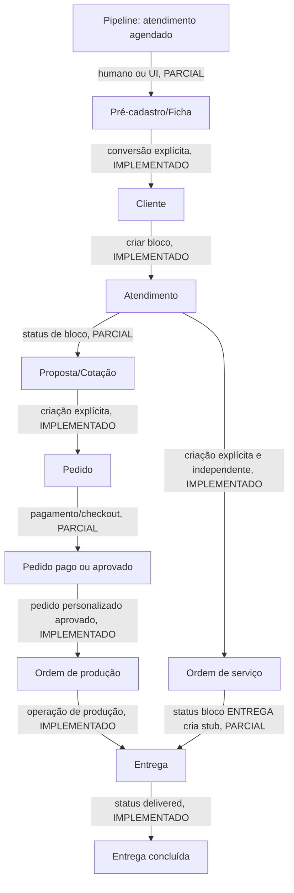

# Fluxo operacional ponta a ponta

## Como ler este documento

Este documento separa propositalmente três coisas diferentes:

1. **Fluxo de uso:** o caminho que cliente e equipe enxergam e usam.
2. **Percurso dos dados:** quais sistemas recebem cada informação.
3. **Processamento interno:** a ordem técnica usada pela API e pelo banco.

O fluxo de uso não é deduzido pela ordem de `INSERT` no banco. A ordem interna
existe para desenvolvimento, diagnóstico e manutenção, mas não define a jornada
operacional. Todas as evidências abaixo são do commit `29c1639`; automações
externas e runtime permanecem marcados como **NÃO HOMOLOGADOS**.

## 1. Fluxo de uso: WhatsApp até atendimento humano

Este é o fluxo normal quando a conversa resulta em agendamento. Nem toda
conversa no WhatsApp precisa terminar em uma visita.

**Regra operacional:** a Agenda é a fonte de verdade para disponibilidade e
agendamento. O Pipeline recebe o lead como consequência do agendamento, pela
configuração de roteamento da Agenda. O Inbox é uma superfície paralela para
histórico e resposta humana, não uma etapa obrigatória antes da Agenda.

## 2. Percurso dos dados entre sistemas

| Dado | Origem | Destino | Finalidade na operação |
| --- | --- | --- | --- |
| Mensagem recebida e resposta do bot | WhatsApp/n8n | Inbox | Manter histórico e permitir continuidade humana no ERP |
| Horários disponíveis | Agenda do ERP | n8n/Lara | Evitar que o bot ofereça horário inexistente |
| Dados confirmados da visita | n8n/Lara | Agenda do ERP | Criar o agendamento com contato, data, horário, motivo e observações |
| Lead e card de trabalho | Regra da Agenda | Pipeline | Entregar o atendimento agendado para a equipe responsável |

## 3. Processamento interno: referência técnica, não jornada de uso

O endpoint `POST /api/v1/n8n/webhook/create-appointment` executa uma transação.
Para manter integridade referencial, o código resolve ou cria o lead, grava o
agendamento e atualiza a etapa do lead no mesmo comando transacional. Essa é a
ordem técnica atual de persistência; se algo falha, a transação é revertida.

Não ler esse diagrama como `Lead → Agenda` no processo comercial. Ele apenas
explica como o backend preserva vínculo e consistência dos dados enquanto
materializa o evento de negócio **agendamento confirmado**.

## 4. Continuação do fluxo de uso no ERP

## 5. Tabela de transições verificadas

| Origem → destino | Como ocorre no código | Status | Limite/risco |
| --- | --- | --- | --- |
| Canal → n8n/Lara | WhatsApp aciona automação externa que conduz SDR e decide se há agendamento | EXTERNO | workflow/runtime não homologados nesta passada |
| n8n/Lara → Inbox | `POST /api/v1/n8n/webhook/new-message` e `bot-reply` registram a conversa | IMPLEMENTADO | histórico não é pré-requisito para criar agendamento |
| n8n/Lara → Agenda | consulta slots e chama `create-appointment` após confirmação do cliente | IMPLEMENTADO | disponibilidade usa agenda local; job requer Redis |
| Agenda → Pipeline | configuração de pipeline do agendamento vincula o lead/card ao fluxo de atendimento | IMPLEMENTADO/PARCIAL | validação em runtime e responsável efetivo ainda não homologados |
| `update-lead` → Pipeline | endpoint direto de upsert por telefone no pipeline `leads` | LEGADO/ALTERNATIVO | não representa o fluxo normal de agendamento e pode contorná-lo se chamado pelo workflow |
| Agenda → pré-cadastro | UI e relações Lead/Cliente estão presentes | PARCIAL | não há conversão automática deduzida desse endpoint |
| Lead → Cliente | atendimento recusa criar bloco quando o ID ainda é lead e orienta conversão pela Ficha | IMPLEMENTADO como guard | endpoint exato de conversão deve ser mantido conforme `customers.routes.ts`; não homologado em browser |
| Cliente → Atendimento | `POST /api/v1/customers/:customerId/blocks` grava `attendance_blocks` | IMPLEMENTADO | exige cliente existente e RBAC |
| Atendimento → Proposta/Cotação | dados de produto, preço e status são mantidos no bloco | PARCIAL | não foi comprovada criação automática de proposta comercial por bloco |
| Cliente → Pedido | `POST /api/v1/orders` cria pedido, itens e detalhes personalizados | IMPLEMENTADO | criação é explícita; não foi achado vínculo automático com proposta/bloco |
| Pedido personalizada aprovado → Produção | PATCH status `APROVADO` cria `production_orders` uma vez, dentro de transação | IMPLEMENTADO | exige detalhe personalizado e permissão `order.approve` |
| Pedido pronta-entrega → estoque/financeiro | serviço de PDV tem transação de venda, baixa e financeiro | PARCIAL | não equivale a todo pedido criado pela tela Pedidos; validar fluxo comercial separado |
| Atendimento → OS | status `OS` apenas gera `so_number` no bloco e exige produto | PARCIAL | não cria `service_orders`; OS tem rota própria e o vínculo precisa ser confirmado operacionalmente |
| OS/Atendimento → Entrega | ao mudar bloco para `ENTREGA`, tenta criar delivery stub não fatal | PARCIAL | no create busca OS ligada ao bloco; no patch cria stub sem `so_id`; `ON CONFLICT` sem alvo é comportamento a validar |
| Pedido → Checkout MP | loja e PDV podem criar preferência Mercado Pago | PARCIAL | confirmação/webhook do pagamento não foi homologado nesta passada |
| Entrega → concluída | rota de status aceita `delivered`, registra data; tracking pode consultar transportadora | IMPLEMENTADO | transportadora e tracking são externos, NÃO VALIDADOS |

## 6. Estados e responsabilidades

| Domínio | Estados/código observado | Responsável que muda | Não assumir |
| --- | --- | --- | --- |
| Lead | `NOVO`, `QUALIFICADO`, `PROPOSTA_ENVIADA`, `NEGOCIACAO`, `CONVERTIDO`, `PERDIDO` | regra da Agenda, operador/pipeline ou endpoint alternativo | que todo stage possui regra de automação |
| Appointment | criação n8n com `AGENDADO`; cancelado/concluído são lidos no cálculo de slots | n8n ou operador | sincronização Google Calendar |
| Bloco de atendimento | pipeline inclui `OS` e `ENTREGA`; campos técnicos, sinal e total | atendente, gerente, produção conforme rota | que `OS` materializa uma `service_order` |
| Pedido | pronta entrega começa `AGUARDANDO_PAGAMENTO`; personalizado começa `AGUARDANDO_APROVACAO_DESIGN` | atendente, financeiro; aprovação com permissão | que todo pagamento baixa estoque automaticamente |
| Produção | pedido personalizado aprovado cria ordem `PENDENTE` em `SOLDA` | produção e aprovador | que uma OS e uma production order sejam a mesma entidade |
| Entrega | `pending`, `posted`, `in_transit`, `out_for_delivery`, `delivered`, `failed`; cancelamento separado | operador ou adaptador de transportadora | emissão de etiqueta e tracking reais sem credenciais |

## 7. Pontos que exigem decisão do negócio

1. Definir a fonte canônica da encomenda personalizada: `attendance_blocks` +
   `service_orders`, ou `orders` + `production_orders`. Hoje coexistem e não há
   ponte automática provada.
2. Definir o evento que converte lead em cliente, inclusive deduplicação por
   telefone/CPF e dono do cadastro. O guard evita atendimento em lead, mas não
   substitui regra de conversão.
3. Definir se `ENTREGA` no bloco deve criar delivery somente quando houver OS,
   pedido, ambos, ou nenhum. O comportamento atual é inconsistente entre create
   e patch.
4. Definir regra única para reserva/baixa de estoque de personalização. A
   configuração de `stock_action` local não é execução de estoque e não entra
   no baseline.
5. Decidir se `update-lead` permanece como caminho alternativo, deve ser
   restrito a casos explícitos ou removido da automação ativa. Ele não pode ser
   apresentado como a origem normal do lead de uma visita agendada.

## 8. Evidências de implementação

- `apps/api/src/routes/n8n.routes.ts`, `appointments.routes.ts` e `inbox.service.ts`
- `apps/api/src/routes/attendance.routes.ts`
- `apps/api/src/routes/orders.routes.ts` e `services/order-financial.service.ts`
- `apps/api/src/routes/service-orders.routes.ts`, `production.routes.ts` e
  `deliveries.routes.ts`
- `apps/web/app/(crm)/clientes/[id]/` e `apps/web/app/(crm)/pedidos/`

Banco, API/Backend, Frontend/UI e integrações externas desta cadeia permanecem
**NÃO HOMOLOGADOS em runtime**. Este documento é mapa para validação, não
autorização de operação ou deploy.
