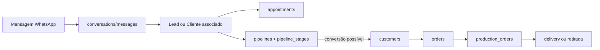

# Operação central, Inbox → Agenda → Pipeline → Pedido → Produção

**Baseline:** `29c1639`. Este documento separa relações confirmadas de
transições automáticas não comprovadas.

## Fluxo operacional encontrado

O diagrama mostra entidades e rotas existentes. Ele não prova que inbox cria
lead, que agenda converte cliente, nem que um pedido sempre gera produção.

## Inbox e WhatsApp

| Elemento | Evidência | Estado/efeito |
| --- | --- | --- |
| Conversa | `conversations` em migration `004` | BOT, AGUARDANDO_HUMANO, EM_ATENDIMENTO, ENCERRADA; pode ligar lead/cliente/atendente |
| Mensagem | `messages` em `004` | inbound/outbound, id Meta único, tipo, mídia, status |
| UI/API | `inbox.routes.ts`, serviço inbox e SSE `/stream` | listar, atribuir, ler, enviar, notas, respostas prontas e handoff |
| Entrada Meta | webhook → BullMQ worker | parser e persistência assíncrona, até 3 tentativas |

Atendente pode responder se é o responsável ou se a conversa está aguardando
humano sem responsável; ADMIN/ROOT têm exceção no serviço. Auditoria anterior
aponta divergência de escopo ROOT no Inbox, portanto o comportamento completo é
**PARCIAL/NÃO HOMOLOGADO**.

## Agenda

`appointments` (migration `042`) aceita lead, cliente ou contato avulso com
nome+telefone. Estados: AGENDADO, CONFIRMADO_CLIENTE, EM_ATENDIMENTO,
CONCLUIDO, CANCELADO e NAO_COMPARECEU. A criação calcula fim por `ends_at`,
duração informada ou configuração; status e alteração têm endpoints próprios.

| Endpoint | Efeito |
| --- | --- |
| `GET /appointments` e `/:id` | leitura filtrável por período, lead, cliente e status |
| `POST /appointments` | grava agenda, audit e pode enfileirar lembrete |
| `PATCH /appointments/:id/status` | muda estado e grava cancelamento quando aplicável |
| `POST /appointments/:id/notify` | tenta notificação/reminder |

O worker consulta lead/cliente, ignora cancelado/concluído e marca lembrete
somente após tentativa de envio via chave/webhook n8n. Entrega real da mensagem
permanece **NÃO VALIDADA**.

## Pipeline e conversão

`pipelines`, `pipeline_stages` e `leads.pipeline_id/stage_id` são a fundação
canônica da migration `017`. Há pipelines padrão de leads, pedidos e produção.
`pipelines.routes.ts` valida nome, slug, etapas, posição, flags ganho/perda e
defaults como SLA, campos requeridos e papel mínimo de movimento.

Movimentar etapa é uma operação de estado, não mera UI. A Ficha busca lead por
WhatsApp e usa `PATCH /api/internal/leads/:id/stage`; a transição recebe regra
de rota/pipeline e precisa de validação runtime para ser declarada concluída.

## Pedido e produção

| Entidade | Estado/controle | Relação |
| --- | --- | --- |
| `orders` | estados de venda, aprovação, produção, retirada/cancelamento | cliente, responsável e itens |
| `production_orders` | PENDENTE, EM_ANDAMENTO, PAUSADA, CONCLUIDA, REPROVADA | `order_id` único, responsável e prazo |
| `production_steps` | SOLDA, MODELAGEM, CRAVACAO, POLIMENTO, CONTROLE_QUALIDADE, CONCLUIDO | etapa concluída, usuário, aprovação/reprovação e evidências |

`production.routes.ts` limita lista a ADMIN/PRODUCAO e escopa produção para o
usuário de produção. Atribuição é gerencial; pausa é overlay com razão/autor e
não altera por si só o status real, conforme comentário da rota.

## Lacunas prioritárias

- Gatilho exato pedido → production_order deve ser confirmado na rota de
  pedidos antes de qualquer mudança de negócio.
- Conversão lead → cliente e agendamento → pipeline não foram executados em
  runtime nesta passada.
- Inbox inbound, reminder n8n e passos de produção têm código, mas não prova de
  fornecedor externo, PostgreSQL real ou browser autenticado.
