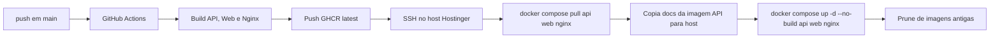

# Runbook operacional, processo atual

## Limite e responsabilidade

Este documento descreve o processo atualmente documentado para o projeto,
conforme `docker-compose.yml` e `.github/workflows/deploy.yml` no baseline
`29c1639`. Não impõe GitFlow, CI/CD, deploy ou infraestrutura à equipe.
Comandos marcados **NÃO VALIDADOS localmente nesta passada** são
derivados do Compose/Action, não executados contra produção.

## Topologia e pré-requisitos

| Componente | Serviço/processo | Persistência/porta | Dependência crítica |
| --- | --- | --- | --- |
| Banco | `postgres` PostgreSQL 16 | volume `postgres_data`, interno | `POSTGRES_PASSWORD` seguro |
| Fila | `redis` Redis 7 | volume `redis_data`, interno | memória fixa e disponibilidade |
| API | `api` Node/Express | interno 4000, uploads em `uploads_data` | banco e Redis saudáveis; roda migrations no boot |
| Web | `web` Next.js | interno 3000 | API interna configurada |
| Borda | `nginx` | 80/443, uploads somente leitura | api e web |
| Administração DB | `adminer` | via Traefik | rede externa `traefik-proxy` |
| n8n | externo ao Compose | não definido aqui | URL/API key/workflows administrados fora deste arquivo |

O host precisa de Docker Compose, acesso ao GHCR, rede Docker externa
`traefik-proxy`, diretório de operação com `docker-compose.yml`, `docs/` e
variáveis de ambiente seguras. Nunca iniciar produção com os valores fallback
de senhas/JWT presentes no Compose de desenvolvimento.

## Subir, parar e reiniciar

No diretório que contém o Compose:

```bash
docker compose up -d
docker compose ps
docker compose logs --tail=200 api web nginx
```

Para parar sem remover volumes:

```bash
docker compose stop
```

Para reiniciar somente componentes de aplicação:

```bash
docker compose restart api web nginx
```

Estes comandos são compatíveis com o arquivo atual, mas **NÃO VALIDADOS em
produção nesta passada**. Não use `down -v`: isso remove volumes e é destrutivo.

## Deploy atual automatizado



O workflow usa `GITHUB_TOKEN` para publicar imagens e requer no deploy SSH
privado e token GHCR, ambos como GitHub Secrets. No host, o script exige token
GHCR não vazio, faz login no registry, trabalha no diretório configurado pela
Action e deliberadamente não recria PostgreSQL nem Redis.

### Rollback

**Não há rollback automatizado ou tag de release imutável no workflow atual.**
Como as imagens usam `latest`, reverter com segurança requer primeiro identificar
um digest ou imagem anterior existente no host/GHCR, documentar o alvo e só então
substituir as referências de imagem de maneira controlada. Esta operação está
**NÃO VALIDADA** e não deve ser improvisada durante incidente.

## Migrations e boot

O comando do serviço API é:

```text
node dist/db/migrate.js && node dist/index.js
```

Logo, migrations pendentes executam antes de a API aceitar tráfego. O ledger
`_migrations` é a evidência no banco do que foi aplicado. Antes de atualizar:

1. confirmar backup restaurável do PostgreSQL;
2. revisar migrations que entrarão na imagem;
3. confirmar espaço em disco e saúde do banco;
4. acompanhar logs da API após recriação.

Não existe neste repositório procedimento de rollback de migration. Trate toda
migration destrutiva como mudança com plano de restauração aprovado.

## Logs e diagnóstico inicial

| Sintoma | Leitura segura | Próximo limite |
| --- | --- | --- |
| API não inicia | `docker compose logs --tail=200 api` | checar migration, conexão Postgres e Redis; não editar banco às cegas |
| Web indisponível | logs de `web` e `nginx`; endpoint `/health` roteia para API | separar falha do frontend de API/Nginx |
| Worker sem lembrete | logs API e conectividade Redis/n8n | jobs/executions reais NÃO VALIDADOS |
| Automação indisponível | logs API; configuração de n8n em Ajustes | não presumir container n8n no host deste Compose |
| Upload falha | logs api/nginx e permissões do volume `uploads_data` | não apagar volume sem backup |
| Pagamento/transportadora falha | logs API e status de integração persistido | não repetir chamadas de cobrança/entrega sem idempotência confirmada |

Evite colar tokens, cookies, CPF, payloads de clientes ou dumps em tickets/logs.

## Backup, restore e recuperação

| Procedimento | Evidência atual | Status |
| --- | --- | --- |
| Backup PostgreSQL | volume nomeado existe; nenhum script canônico localizado | NÃO VALIDADO |
| Backup uploads | volume nomeado existe; nenhum script canônico localizado | NÃO VALIDADO |
| Backup Redis | volume existe; não é fonte transacional primária declarada | NÃO VALIDADO |
| Restore | nenhum runbook/script homologado localizado | NÃO VALIDADO |
| Recuperação de migration | ledger `_migrations` e logs existem | PARCIAL, sem rollback documentado |

A equipe deve definir, testar e registrar RPO/RTO, criptografia e
retenção antes de considerar o ambiente operável para produção.

## Checklist pós-deploy recomendado

1. Confirmar `docker compose ps` e saúde da API via `/health`.
2. Conferir logs recentes sem erro de migration/Redis.
3. Abrir login e uma rota autenticada em navegador.
4. Verificar uma leitura de cliente/pedido sem alterar dados.
5. Testar integrações apenas em ambiente controlado, sem disparar mensagem,
pagamento ou transportadora por acidente.

Os itens 3–5 não foram executados nesta segunda passada e permanecem
**NÃO HOMOLOGADOS**.
